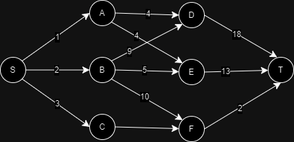

[Home](../../README.md) | [Dynamic Programming](../theories/dynamic-programming.md)

# Multistage Graph

A multistage graph is a directed graph where vertices are partitioned into a number of disjoint sub-sets and all edges are from a stage to the next stage.

Given a multistage graph, a source and a destination, the goal is to find the shortest path.

## Given

- A diagram of the graph with source `s` and destination `t`

## Procedure

- Start from the destination and calculate the minimum cost from current vertex to the destination using the following formula.

```
cost(i, j) = min{c(j, l) + cost(i + 1, l)}
where l is the vertices connected to the current vertex
```

- Construct the shortest path by taking the minimum cost vertex from each stage.

## Simulation

Given



Step 1:

```
cost(4, t) = 0
```

Step 2:

```
cost(3, d) = 18
cost(3, e) = 13
cost(3, f) = 2
```

Step 3:

```
cost(2, a) = min{
                c(a, d) + cost(3, d),
                c(a, e) + cost(3, e)
            }
            = min{4 + 18, 4 + 13} = 17

cost(2, b) = min{
                c(b, d) + cost(3, d),
                c(b, e) + cost(3, e),
                c(b, f), cost(3, f)
            }
            = min{4 + 18, 4 + 13, 10 + 2} = 12

cost(2, c) = min{
                c(c, f) + cost(3, f),
            }
            = min{2 + 2} = 4
```

Step 4:

```
cost(1, s) = min{
                c(s, a) + cost(2, a),
                c(s, b) + cost(2, b),
                c(s, c) + cost(2, c),
            }
            = min{1 + 17, 2 + 12, 3 + 4} = 7
```

The shortest path is:

```
s -> c -> f -> t
  3    2    2

```
