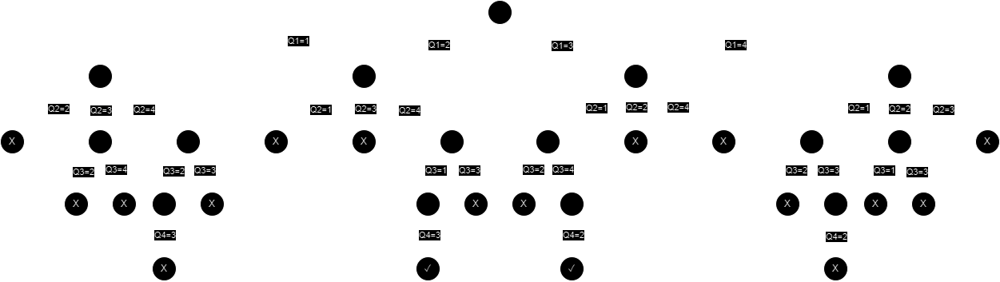

[Home](../../README.md) | [Backtracking](../theories/backtracking.md)

# N-Queens Problem

Given an `n*n` chessboard and `n` queens, find all possible ways to place the queens such that they do not attack each other (colors are irrelevant, any queen can attack any other).

## Procedure

- Start in the first column of first row.
- If all queens are placed: Return true.
- Try all columns in the current row:
  - If a queen can be placed safely in the column:
    - Mark the row-column pair as part of the solution.
    - Recursively check if placing the queen in the current column leads to a solution.
  - Else:
    - Unmark the row-column pair from the solution.
- If all rows have been checked: Return false.

## Simulation (for n = 4)

State space tree:

Solution:

|     | Q   |     |     |
| --- | --- | --- | --- |
|     |     |     | Q   |
| Q   |     |     |     |
|     |     | Q   |     |

|     |     | Q   |     |
| --- | --- | --- | --- |
| Q   |     |     |     |
|     |     |     | Q   |
|     | Q   |     |     |
