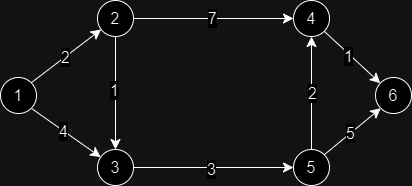

[Home](../../README.md) | [Greedy Method](../theories/greedy-method.md)

# Single Source Shortest Path (Dijkstra's Algorithm)

Given a weighted graph, find the shortest path from a single source vertex to all other vertices.

## Given

A graph with weighted edges and a source.

## Procedure

- Calculate the immediate cost of each vertex from the source vertex. If there is no direct path, mark it as infinite.

- Take the unvisited vertex with the least cost and perform [relaxation](#relaxation) on it.

- Repeat until all vertices are visited.

### Relaxation

Updating the minimum cost of the vertexes connected to the current vertex.

## Complexity

At worst case, every vertex is connected to every other vertex and the total cost is O(n<sup>2</sup>).

## Simulation

### Given



### Solution

| Visited Vertex | 1             | 2                          | 3                          | 4                          | 5                          | 6                          |
| -------------- | ------------- | -------------------------- | -------------------------- | -------------------------- | -------------------------- | -------------------------- |
| 1              | 0<sub>1</sub> | <mark>2<sub>1</sub></mark> | 4<sub>1</sub>              | &infin;                    | &infin;                    | &infin;                    |
| 2              | 0<sub>1</sub> | 2<sub>1</sub>              | <mark>3<sub>2</sub></mark> | 9<sub>2</sub>              | &infin;                    | &infin;                    |
| 3              | 0<sub>1</sub> | 2<sub>1</sub>              | 3<sub>2</sub>              | 9<sub>2</sub>              | <mark>6<sub>3</sub></mark> | &infin;                    |
| 5              | 0<sub>1</sub> | 2<sub>1</sub>              | 3<sub>2</sub>              | <mark>8<sub>5</sub></mark> | 6<sub>3</sub>              | 11<sub>5</sub>             |
| 4              | 0<sub>1</sub> | 2<sub>1</sub>              | 3<sub>2</sub>              | 8<sub>5</sub>              | 6<sub>3</sub>              | <mark>9<sub>4</sub></mark> |
| 6              | 0<sub>1</sub> | 2<sub>1</sub>              | 3<sub>2</sub>              | 8<sub>5</sub>              | 6<sub>3</sub>              | 9<sub>4</sub>              |

Therefore, the shortest path from 1 to 6 is 9.

```
6 ← 4 ← 5 ← 3 ← 2 ← 1
```
