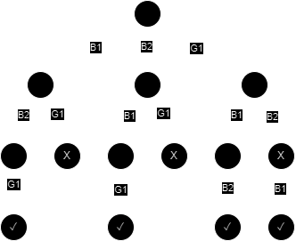

[Home](../../README.md)

# Backtracking

A brute force method to find all feasible solution according to some constraints called the **Bounding Function**.

## State Space Tree

A way to represent all feasible solutions in a tree.

The tree constructed to implement backtracking with the choices for the components is called a state space tree. The root of the tree represents the initial state and the nodes at each level represent the choices made for the corresponding component of a solution.

## Forward Checking

A type of filtering used in backtracking search to detect inevitable failures early. (Checking the bounding function at each level. If a level does not satisfy the function, no need to calculate this path any more.)

## Basic example

Find all possible combinations of 2 boys and 1 girl and 3 seats so that the girl is not in the middle seat.

### State Space Tree

Possible solutions:

- B1, B2, G1
- B2, B1, G1
- G1, B1, B2
- G1, B2, B1

## Problems

- [N-Queens Problem](../implementations/n-queens-problem.md)
